[English](README.md) · **中文**

# AiKey Production 产品亮点

> 把 Claude、Codex、Kimi 的 KEY、账号与路由统一管理，让团队在不中断工作的情况下切换额度、观察成本、编排多模型生产力。

## 让 AI 工具更像一个工作台

- KEY 和账号只导入一次，Claude、Codex、Kimi、Cursor、OpenCode 都能接上。
- 真实凭证留在 Vault 里，日常只分发可撤销、可复制、可管理的路由入口。
- 额度快用完时，不必停下当前会话，换个账号继续把思路跑完。
- 用量、token、provider 趋势都看得见，成本优化不再等到账单出来才开始。
- 把多个 AI 账号编排成一套路由，让个人探索、团队开发和脚本任务各走各的路。

## 核心亮点

### 1. 一键导入 KEY 与账号

团队里常见的麻烦不是没有 KEY，而是 KEY 散落在终端环境变量、脚本、个人电脑和第三方客户端里。复制一次就多一个泄漏点，换人、换机器、换额度时也很难确认谁还在用哪一份真实凭证。

> AiKey 的做法是把 API Key 和 OAuth 账号统一导入本地或团队 Vault。真实凭证不需要暴露给终端、脚本或第三方客户端；日常使用只分发可控的路由 token 或当前 active 绑定。

```bash
aikey add anthropic:work        # 导入 Claude API Key
aikey web --import              # 或在 Web 端一键导入

aikey auth login claude         # 或登录 Claude 账号
aikey use                       # 选择当前使用的 KEY / 账号
```

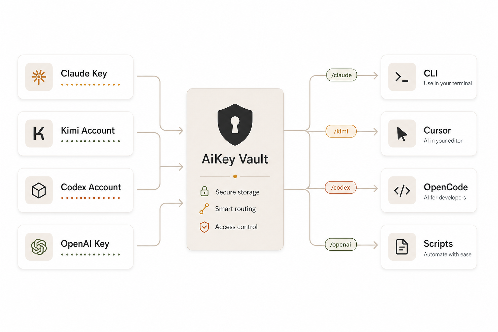

**敏感凭证集中保管，工作入口自由分发。**

> ✨ 操作走查 → [个人版完整流程 · 步骤 3：Vault 添加 KEY](#3-vault-页面添加-key同意顶部-install-hook)

### 2. 用量趋势与 token 成本洞察

AI 成本最容易在日常协作里变成一笔糊涂账：谁在高频调用、哪个账号突然变贵、发布前后 token 是否异常增长，往往要到账单出来后才发现。没有趋势和结构，就很难把优化变成日常动作。

> AiKey 的控制台会展示每个 KEY、账号、协议的用量趋势，帮助团队定位高频使用来源。结合 token 使用结构，例如 cache token 占比、请求量和 provider 分布，可以辅助发布前后做费用复盘与成本优化。

```bash
aikey web                       # 打开控制台查看 Vault、用量和 token 结构
```

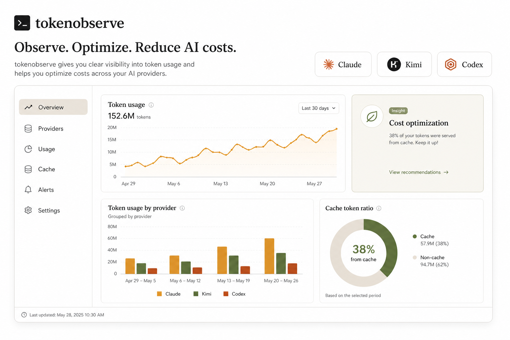

**不只会用 KEY，还能看懂 KEY 怎么被用。**

> ✨ 操作走查 → [个人版完整流程 · 步骤 4：聊天后查看费用小票](#4-运行-claude聊天后查看费用小票) · [步骤 6：查看用量统计](#6-查看用量统计)

### 3. 多窗口、多应用、多账号同时工作

真实工作流很少只开一个 AI 工具：一个窗口在跑 Claude，一个编辑器在补代码，一个脚本在批量处理。所有工具共享同一组环境变量时，账号很容易互相抢占，测试、开发和自动化任务也会彼此干扰。

> AiKey 支持 Claude、Codex、Kimi 等不同 CLI，也支持 Cursor、OpenCode、Continue 等第三方客户端。多个终端窗口可以使用不同账号或临时激活不同 KEY，让研发、测试、脚本和个人探索互不干扰。

```bash
claude                          # 窗口 A：Claude
codex                           # 窗口 B：Codex
kimi                            # 窗口 C：Kimi

aikey activate claude2          # 窗口 D：同时使用 claude2 账号
claude
```

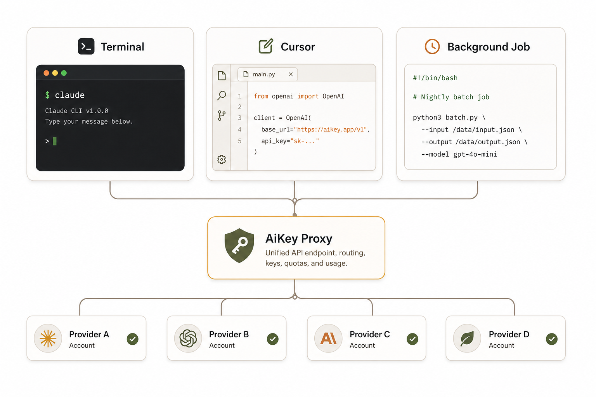

**一个工作站，同时跑多个 AI 工作流。**

> ✨ 操作走查 → [个人版完整流程 · 步骤 4：运行 claude / kimi / codex](#4-运行-claude聊天后查看费用小票) · [步骤 5：切换 Key](#5-切换-keyweb-端--cli-双入口)

### 4. 额度不足时无缝切换账号

最影响心流的不是额度不足本身，而是额度在长对话、代码审查或排障中途突然耗尽。重新登录、重启 CLI、复制上下文都会打断思路，也可能让还没完成的任务丢掉节奏。

> AiKey 让额度切换变成会话外的动作。当当前 Claude 账号或 KEY 额度不足时，用户不需要退出正在运行的 `claude` 会话；执行 `aikey use <另一个账号>` 后，运行中的会话会在下一次请求使用新的 active 绑定继续工作。

```bash
aikey use backup-account        # 不退出当前 claude，会话继续使用新账号
```

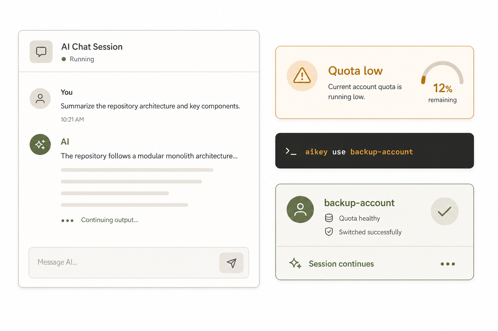

**额度用完，不打断思路。**

> ✨ 操作走查 → [个人版完整流程 · 步骤 5：切换 Key（Web 端 / CLI 双入口）](#5-切换-keyweb-端--cli-双入口)

### 5. 自定义路由与多模型编排

当团队同时使用多个模型和多个账号时，真正复杂的是选择：代码任务该走哪个模型，批处理该避开哪个贵账号，主账号不可用时如何自动兜底。如果每个客户端都单独配置，路由策略会很快失控。

> 通过 `aikey route` 输出的 `base_url` 和 `api_key`，用户可以把多个 Claude、Kimi、Codex 或 OpenAI 兼容账号接入自己的客户端、脚本或网关。高级用户可以在此基础上开发自己的路由策略，按模型、任务、额度或成本编排账号使用。

```bash
aikey route                     # 查看所有可用路由
aikey route work                # 复制指定 KEY 的 base_url + api_key
```

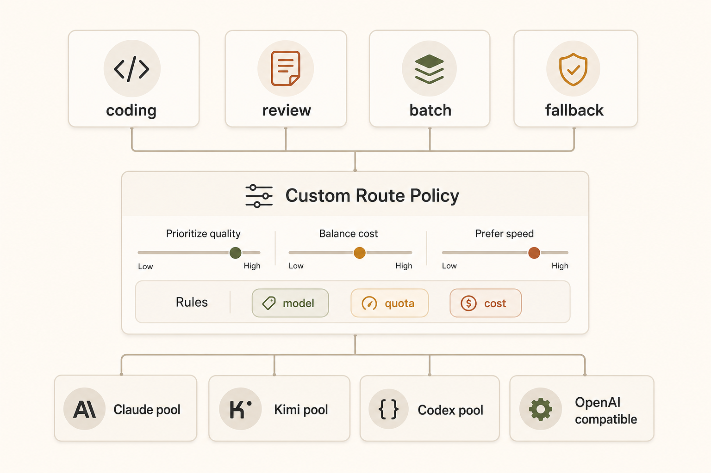

**把多个 AI 账号，编排成一套可控路由。**

> ✨ 操作走查 → [详细命令参考 · 在第三方 AI 客户端中使用 Key](#高级用法在第三方-ai-客户端中使用-key)


# aikey 快速开始

---

## 安装

### macOS / Linux

**最新稳定版**（推荐 —— 自动解析最新 GA tag）：

```bash
curl -fsSL https://github.com/aikeylabs/launch/releases/latest/download/latest-install.sh | sh
```

安装到 `~/.aikey/bin`。

---

## 个人版完整流程

> 端到端日常使用流程：**装好 → 加 Key → 聊天 → 看小票 → 切换 → 看统计**。每一步附截图占位，并标注它兑现了哪一条产品亮点。每一步的命令细节和高级用法见下方 [详细命令参考](#使用个人-api-key)。

### 1. 安装 CLI + source

按上面的 [`## 安装`](#安装) 完成安装后，让 PATH 立即生效：

```bash
source ~/.zshrc    # 或 source ~/.bashrc，按你的 shell
```

Windows PowerShell 见下方 [Windows 专属](#windows-专属) 一节，原生 PowerShell 安装，**无需** WSL。

> 终端 `local-install.sh` 完成后的输出（应能看到 `aikey` 已安装到 `~/.aikey/bin`）
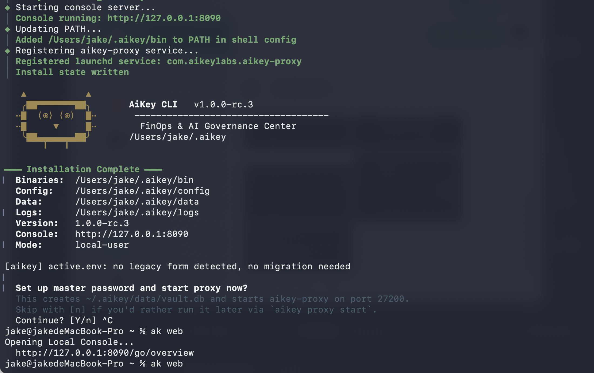

### 2. 打开 aikey web

```bash
aikey web
```

会自动在浏览器打开本地 vault 控制台。

> `aikey web` 首次打开的页面（Vault 列表为空 / 未添加任何 Key）
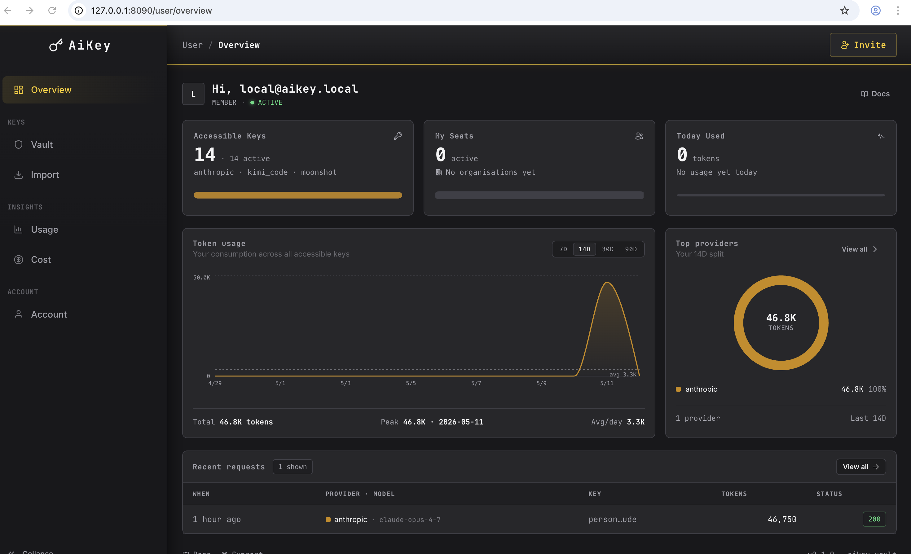

### 3. Vault 页面添加 KEY，同意顶部 install hook

✨ **对应亮点 1：一键导入 KEY 与账号** —— 真实凭证只进入本地 Vault；日常分发的是可撤销的路由 token。

在 **Vault** 页面（侧边栏 My Vault，或 `aikey web --vault`）添加 Key。三种方式：


- **A) API Key**：点击「Add Key」，填 alias + provider + 真实 key → 保存。
> Vault 页面 + 顶部 Install hook 横幅 + 「Add Key」表单
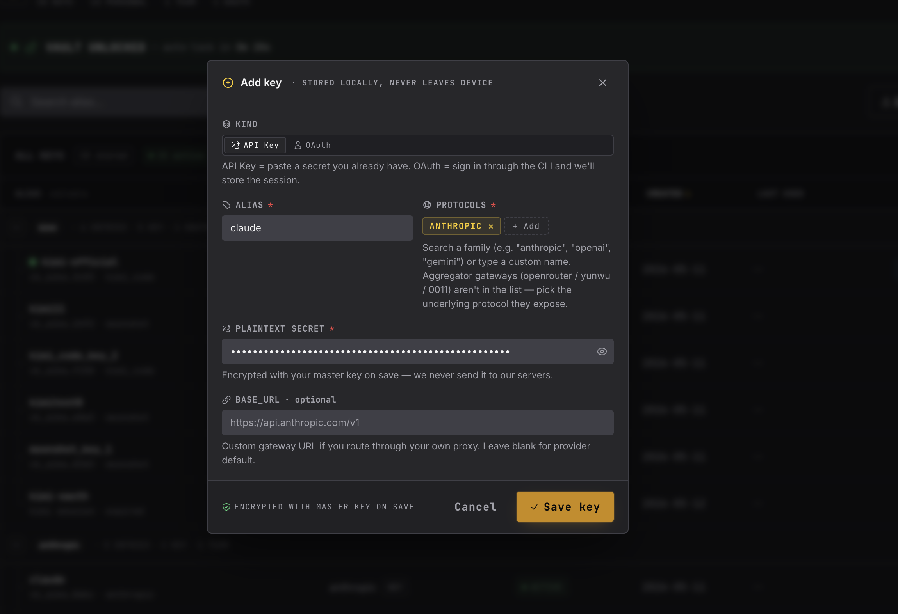


- **B) API Key(从 CLI 添加 )**：
> 按照 CLI 指引完成添加。
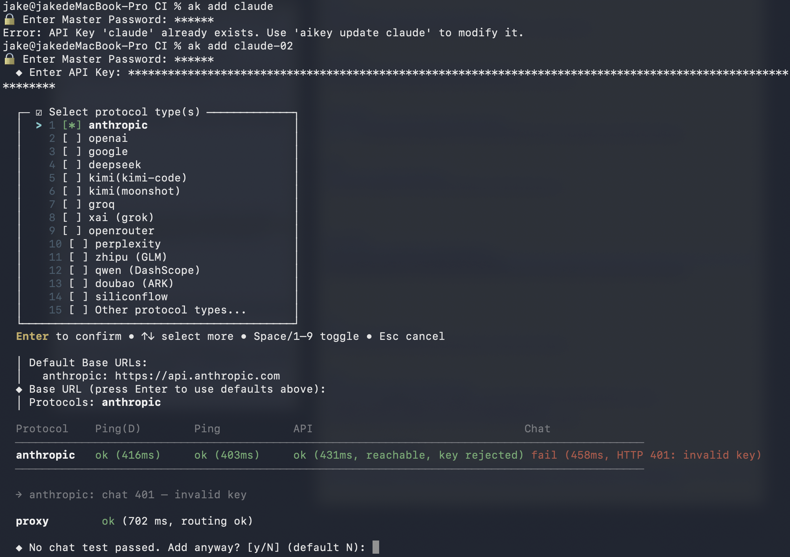

- **C) 批量导入**：
> 侧边栏 Import，或 `aikey web --import` 打开批量导入页面
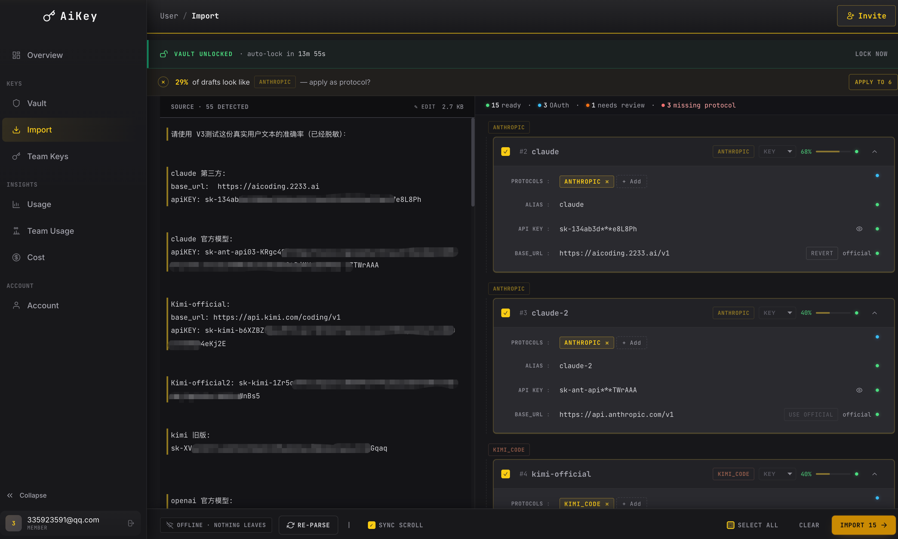

- **D) OAuth 账号**（Pro / Max / Plus 订阅）：点击 OAuth 登录，浏览器完成授权后自动回写。也可走 CLI：

  ```bash
  aikey auth login claude        # Claude (Anthropic)
  aikey auth login codex         # Codex / ChatGPT (OpenAI)
  aikey auth login kimi_code     # Kimi Code (api.kimi.com); 'kimi' alias 仍可用
  ```

> 添加后页面顶部会出现 **「Install hook」横幅**，点击安装 —— shell hook 写到本地 rc 文件，让 `claude` / `codex` / `kimi` 等 CLI 在新开 Terminal 中自动识别 active key。
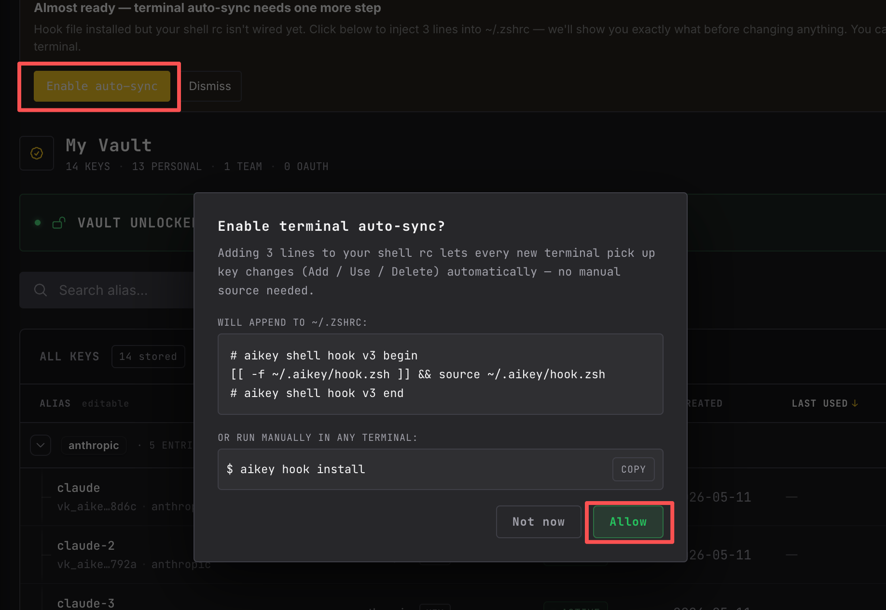


> 添加完成后的 Vault Key 列表（API Key + OAuth 账号并存）
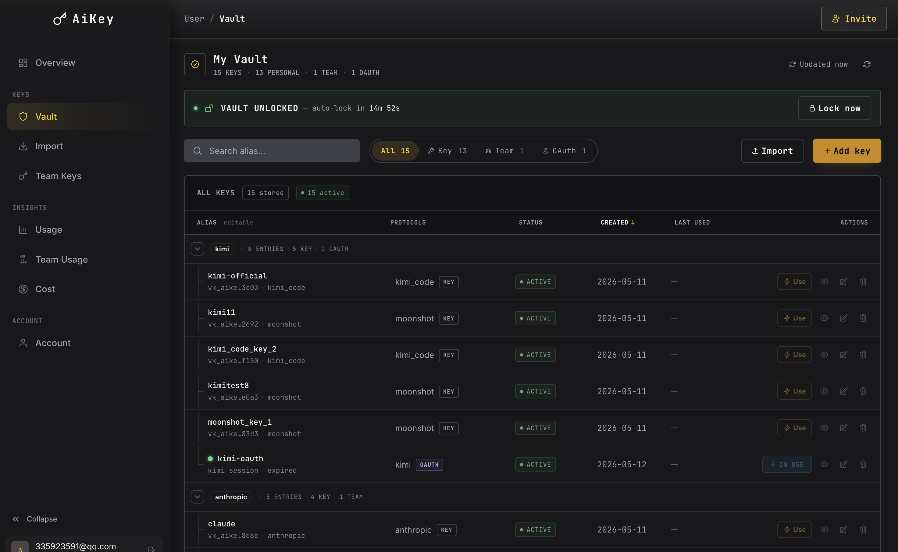

### 4. 运行 claude，聊天后查看费用小票

✨ **对应亮点 2 + 3：多窗口多账号同时工作 + 用量趋势与 token 成本洞察**

打开**新的** Terminal（让 hook 生效），运行：

```bash
claude        # 或 kimi、codex —— 视 Vault 中已添加的 Key/账号而定
```

聊天结束、退出会话后，AiKey 会在终端打印一份**费用小票**（cost receipt），列出本次会话的 token 用量与估算费用 —— 不必等到月底账单，实时把控成本。

> 新开 Terminal 运行 `claude` 后的交互界面
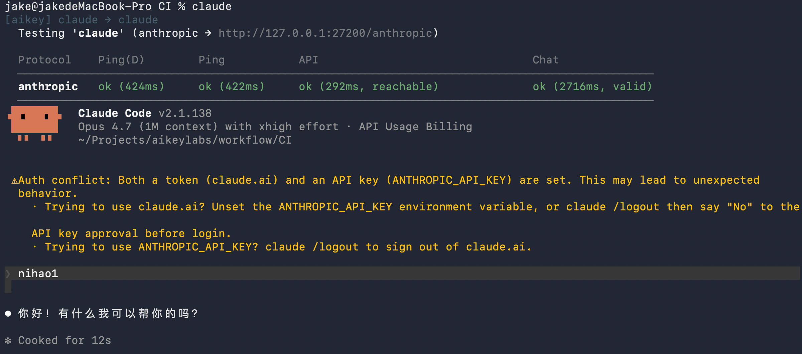

> claude 退出后终端打印的费用小票（token 用量 + 估算费用）
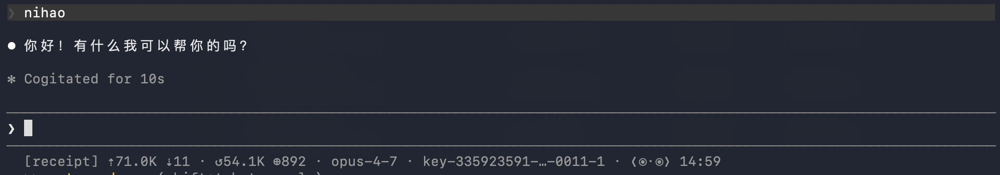

### 5. 切换 Key（Web 端 / CLI 双入口）

✨ **对应亮点 4：额度不足时无缝切换账号** —— 不用退出正在运行的 `claude` 会话，下一次请求就生效。

> **Web 端**：在 Vault 页面点击某个 Key，将其设为当前 active —— 影响所有新开 CLI 窗口。
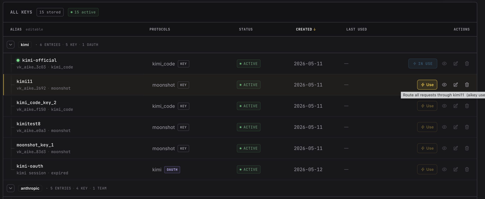

**CLI 全局切换**（持久，写入 `active.env`）：

```bash
aikey use my-key                  # 切换全局 active key
```

**CLI 临时切换**（仅当前终端）：

```bash
aikey activate my-key             # 仅当前终端 env，关掉终端即恢复
(my-key) ~/Projects %             # 提示符显示当前激活的 Key

aikey deactivate                  # 立刻恢复全局设置
```

> 终端执行 `aikey use my-key` 的输出（或 Web 端 Vault 切换 active key 的画面）
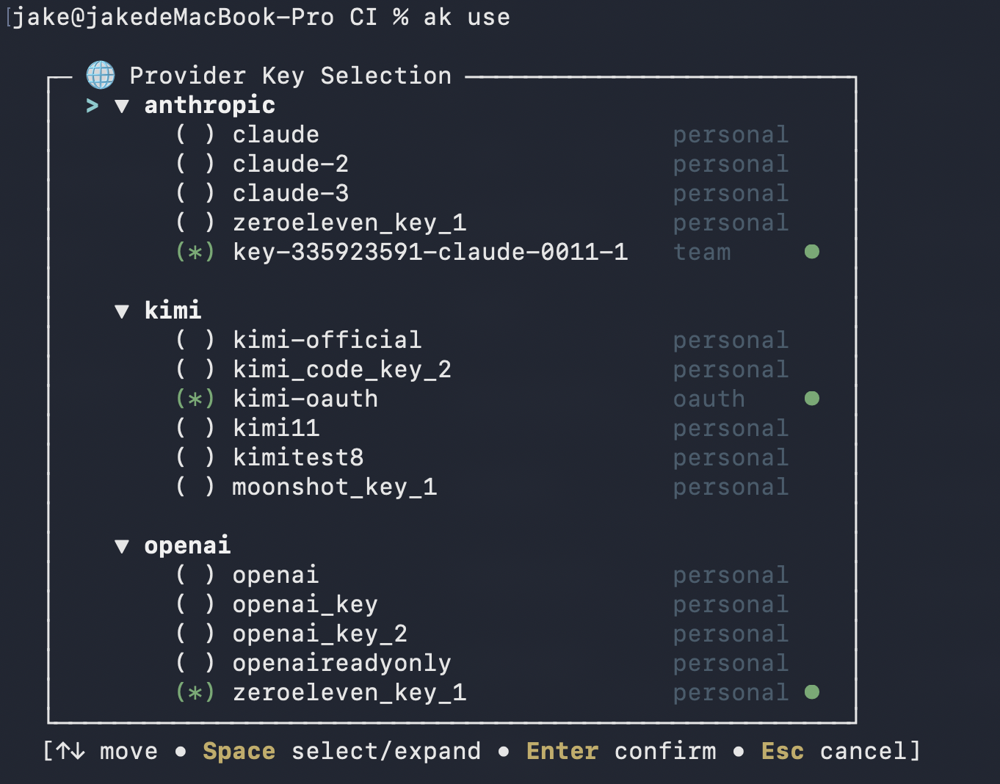

### 6. 查看用量统计

✨ **对应亮点 2：用量趋势与 token 成本洞察**

```bash
aikey web                # 浏览器打开控制台 → Usage / Dashboard
```

控制台展示每个 Key、账号、provider 的用量趋势 + token 结构（cache token 占比、请求量、provider 分布），帮助发布前后做费用复盘与成本优化。

> aikey web 用量 / Usage Dashboard 主视图（token 趋势 + provider 分布）
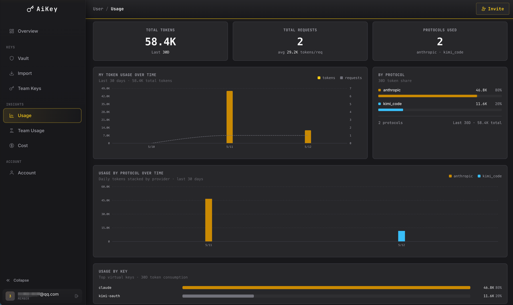

---

## 使用个人 API Key

> ⚠️ **`aikey login` 和 `aikey auth login` 是两件事，不要混用：**
> - `aikey login`（即 `aikey account login`）—— **登录 AiKey 控制服务**（团队版连接到 server，建立 CLI 与控制面的会话）；个人版用不到。
> - `aikey auth login <claude/codex/kimi>` —— **添加 Provider OAuth 账号到本地 vault**（Claude Pro/Max、ChatGPT Plus、Kimi Code 等订阅，无需 API Key）。

将你的 API Key 添加到本地加密 vault：

```bash
aikey add my-key
```

激活当前 Key：

```bash
aikey use my-key
```

然后直接使用你常用的工具 — 本地代理自动注入 Key：

```bash
claude              # Anthropic Claude CLI
codex               # OpenAI Codex CLI
kimi                # Kimi CLI（kimi(kimi-code) 与 kimi(moonshot) 通用）
```

Key 通过本地代理路由，不会暴露真实凭证。

### 用 Provider OAuth 账号登录（无需 API Key）

如果你有 Claude Pro/Max、ChatGPT Plus、Kimi 订阅等账号，可以用 `aikey auth login <provider>` 把 Provider 的 OAuth 账号加进本地 vault，**不需要 API Key**：

```bash
aikey auth login claude       # Claude (Anthropic) — Pro / Max 订阅
aikey auth login codex        # Codex / ChatGPT (OpenAI) — Plus / Pro 订阅
aikey auth login kimi_code    # Kimi Code (api.kimi.com); 'kimi' alias 仍可用
```

> 这里的 `auth login` 是**给本地 vault 添加 Provider 凭证**，跟团队版的 `aikey login`（连接 AiKey 控制服务）不是同一件事。

Provider OAuth 账号和 API Key 都通过 `aikey use` 切换 active。

查看已添加的所有 Key：

```bash
aikey list
```

查看 Key 的路由配置（用于第三方客户端）：

```bash
aikey route
```

打开 Web 控制台查看 Key 状态、用量和更多管理功能：

```bash
aikey web
```

侧边栏 **My Vault**（或 `aikey web --vault`）展示本机 vault 里的所有 Personal
API Key 和 OAuth 账号，支持改别名、一次性 reveal（前端 60 秒自动重新遮罩）、
删除、新增。unlock 会话与 Import 页面共享。OAuth session token **永不**在
浏览器展示；新增 OAuth 账号请走 `aikey auth login <provider>`。

---

## CI / 脚本（无交互）

不依赖 shell hook，适合 GitHub Actions、定时任务等。

```bash
aikey run -- python eval.py
```

---

## 日常操作速查

```bash
aikey list              # 查看所有 Key
aikey use               # 切换当前 Key
aikey whoami            # 查看当前身份和当前 Key
aikey env               # 查看 active.env (shell 注入) 和 proxy.env (proxy 进程)
aikey env set KEY=VAL   # 合并写入 proxy.env，常用于配 https_proxy / http_proxy
aikey doctor            # 一键自检
aikey test --all        # vault 里所有 Key 全量体检（见下）
```

> 提示：安装器会同时把 `aikey` 软链一份成 `ak`，所有命令都可以用短别名调用（如 `ak env`、`ak use`、`ak doctor`）。

---

## 测试 Key 连通性

```bash
aikey test                # 当前已激活的 Primary 绑定逐个体检
aikey test my-key         # 指定 Key,跨该 Key 支持的所有协议各跑一行
aikey test --all          # vault 里所有 Key (personal / team / OAuth) 全量体检
```

每行依次跑 **Ping(D) → Ping(代理) → API → Chat** 四阶探测。多协议 Personal Key 会按 `supported_providers` 展开成多行(比如 0011 聚合网关同时支持 `anthropic + openai + kimi` 时显示 3 行,Key 列同名,Protocol 列分别);团队 Key 和 OAuth 协议固定,各一行。`--all` 适合批量导入新 Key 后或排查"某个 Key 突然不通"时做全量自检,Key 列显示友好别名(`key-335923591-0011-1` / 邮箱),不是 vk_id 尾巴。

---

## 高级用法：临时切换 Key

使用 `aikey activate` 在当前终端临时切换 Key。与 `aikey use` 不同，它**不会**修改全局设置或 active.env — 关闭终端即恢复。

```bash
aikey activate my-key               # 在当前终端激活
(my-key) ~/Projects %               # 提示符显示当前激活的 Key

aikey activate team-key --provider openai   # 切换到另一个 Key
(team-key) ~/Projects %

aikey deactivate                     # 立即恢复全局设置
~/Projects %
```

- `activate` 通过 `eval` 设置 shell 环境变量 — 需要先通过 `aikey use` 安装 shell hook
- `deactivate` 立即恢复 active.env 中的全局设置（无需等待下一次 prompt）
- 多个终端可以同时激活不同的 Key
- 当 Key 支持多个 provider 时，需要加 `--provider` 参数

---

## 高级用法：在第三方 AI 客户端中使用 Key

在 Cursor、OpenCode、Continue 或任何支持自定义 `base_url` + `api_key` 的 AI 客户端中配置：

```bash
aikey route                     # 列出所有路由 token
aikey route my-key              # 查看指定 key 的可粘贴配置
```

示例输出：

```
  # Configuration for: my-key (personal, anthropic)
  base_url:  http://127.0.0.1:27200/anthropic
  api_key:   aikey_vk_b82ef1d49c3a7e08...
```

将 `base_url` 和 `api_key` 粘贴到客户端设置中。代理通过 token 路由请求 — 真实凭证始终保留在 vault 中。

### OpenCode

创建或编辑 `~/.config/opencode/opencode.jsonc`：

```jsonc
{
  "$schema": "https://opencode.ai/config.json",
  "provider": {
    "anthropic": {
      "options": {
        "baseURL": "http://127.0.0.1:27200/anthropic/v1",
      }
    }
  },
  "model": "anthropic/claude-opus-4-7"
}
```

Provider 选择官方 `anthropic`，`baseURL` 指向本地代理，然后在 OpenCode 中填入 `aikey route my-key` 显示的 API Key 即可使用。

---

## 遇到问题？

```bash
aikey doctor            # 自动检查所有常见问题
aikey proxy restart     # proxy 卡住时重启
aikey key sync          # Key 状态不对时强制同步
```

### Windows 专属

#### Windows上安装（PowerShell 原生，**无需** WSL）
(Windows 兼容尚在优化中,敬请期待)

> Stage 4 windows-compat。最低支持：Windows 10 1809+ / Windows 11 /
> Windows Server 2019+。在 PowerShell 7+（推荐）或 Windows PowerShell 5.1
> 下均可。

```powershell
# 下载 installer 包（包含 entrypoint + lib/*.ps1），解压、运行
# 通过 GitHub API 自动解析 latest tag —— 无需硬编码版本号
$Tag  = (Invoke-RestMethod "https://api.github.com/repos/aikeylabs/launch/releases/latest").tag_name
$Bare = $Tag.TrimStart('v')
iwr "https://github.com/aikeylabs/launch/releases/download/$Tag/aikey-installer-windows_${Bare}.zip" -OutFile "$env:TEMP\aikey-inst.zip"
Expand-Archive -Path "$env:TEMP\aikey-inst.zip" -DestinationPath "$env:TEMP\aikey-inst" -Force
& "$env:TEMP\aikey-inst\local-install.ps1"     # 不带 -Version 则 installer 自解析 latest
```

> 为什么是"下 zip + 解压 + 运行"三步而不是一行 `iwr | iex`：`.ps1`
> 入口脚本会从 `$PSScriptRoot/lib` 加载 `health/service/backup.ps1`，
> 这些 lib 必须在运行时落在 entrypoint 旁边的磁盘上；zip 保留了
> 这个相对结构。功能上等价于 macOS / Linux 的 `curl ... | sh`。

安装到 `%LOCALAPPDATA%\Aikey\bin` 并自动追加到当前用户 `PATH`。安装器
把 install dir 的 NTFS ACL 收紧到 owner-only —— 加密 vault 永远不会被
同台机器的其他用户读到。

如需 PowerShell hook 自动激活（运行 `aikey use foo` 后，新开 PowerShell
会自动带上对应 env vars），安装后执行：

```powershell
aikey hook install
```

这会向 `$PROFILE.CurrentUserAllHosts` 追加一个标记块（执行前会问你确认；
传 `-Yes` 自动同意）。

---


| 现象 | 可能原因 + 修复 |
|---|---|
| `aikey hook update` 报 `hook.ps1` EACCES | 另一个 PowerShell 会话占着这个文件。先关掉别的 PS 窗口，**不要**用 sudo —— 提权解决不了句柄占用。 |
| 装完立刻 `aikey: command not found` | 新 PATH 只在**新开**的 PowerShell 窗口生效。开个新终端，或重启当前终端。 |
| `aikey use <alias>` 跑过了，但下一个 prompt 没看到 env vars | PowerShell hook 没装。执行 `aikey hook install`（写入 `$PROFILE.CurrentUserAllHosts`）。 |
| `aikey-proxy.exe` 升级时报"file in use" | 先关掉运行中的 proxy：`aikey proxy stop`（清理退出），再重跑安装。如还有残留，用 `Stop-Process -Force` 强杀旧 `.exe`。 |
| Claude Code 交互模式无视 `ANTHROPIC_API_KEY` | 这是 known issue —— `aikey use` 会向 `~/.claude.json` 的 `customApiKeyResponses.approved` 写一个 sentinel 来预批准这个 env var。如果手工清过 `.claude.json`，重跑一次 `aikey use <anthropic-alias>` 即可。详见 bugfix `2026-04-29-claude-interactive-ignores-anthropic-api-key.md`。 |

重新安装 = 升级，直接运行:

```bash
curl -fsSL https://github.com/aikeylabs/launch/releases/latest/download/local-install.sh | sh

```

**环境变量管理（`aikey env` / `ak env`）:**

AiKey 维护两份 env：

- `~/.aikey/active.env` —— **shell 侧**衍生环境（hook 注入 `claude` / `codex` / `kimi` 用的 KEY / endpoint，由 `aikey use` 自动写入，不要手改）。
- `~/.aikey/proxy.env` —— **proxy 进程**专属环境（出网代理、自定义 endpoint 覆盖等，由用户管控）。

```bash
aikey env                  # 查看两份 env（敏感值自动遮罩；proxy.env 显示条目数+配置哈希）
```

**配出网代理（access github / provider 需要走梯子的场景）:**

```bash
aikey env set -- export https_proxy=http://127.0.0.1:7890;export http_proxy=http://127.0.0.1:7890;export all_proxy=socks5://127.0.0.1:7890
aikey proxy restart        # 改完 proxy.env 必须重启 proxy 才生效
```

> `aikey env set` 只写 `proxy.env`、**不会动** `active.env`；以 merge-update 方式合并已有键值，不会全量覆盖。支持 `KEY=VAL`、多对组合、可带 `export` 前缀、分号分隔混合输入。如果当前 `proxy.env` 解析失败会停下来要求先修复。


**删除数据重装:**

```bash
# 危险：先全清，再装最新版（管道场景下走 /dev/tty 弹 y/N，可加 --yes 跳过）
curl -fsSL https://github.com/aikeylabs/launch/releases/latest/download/latest-install.sh | sh -s -- --clear

# 删除数据并安装指定版本（把 <TAG> 替换成想固定的版本，如 v1.0.0-rc.3）
curl -fsSL https://github.com/aikeylabs/launch/releases/download/<TAG>/local-install.sh | sh -s -- --version <TAG> --clear
```


**仅卸载（不重装）:**
```bash
# 危险：清掉 ~/.aikey、第三方 CLI 注入、shell hook、OS keychain，但不重装
curl -fsSL https://github.com/aikeylabs/launch/releases/latest/download/uninstall.sh | sh -s -- --yes
```
